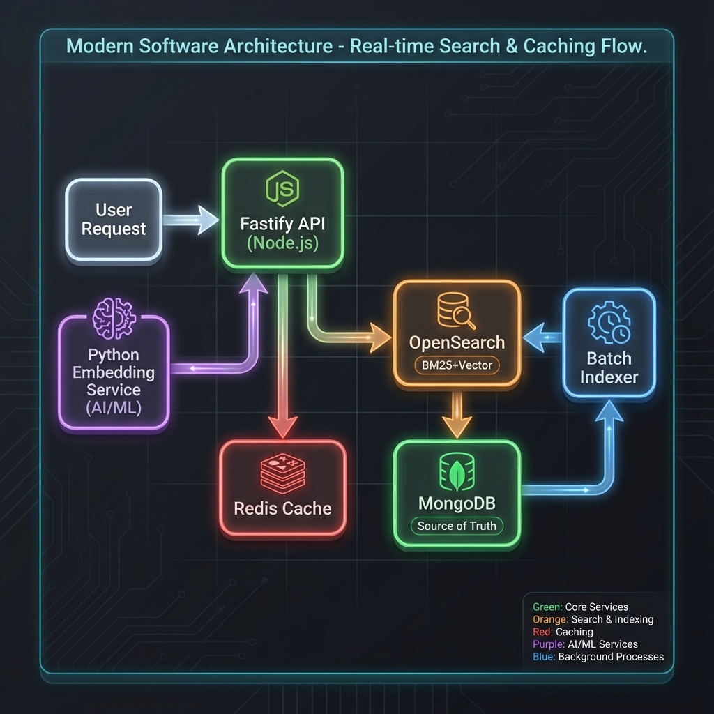

# 🔬 Research Search Engine

> **Production-grade academic research discovery platform powered by hybrid AI search**


<p align="center">
  
  
  
  
  
</p>

<p align="center">
  <a href="#-features">Features</a> •
  <a href="#-architecture">Architecture</a> •
  <a href="#-quick-start">Quick Start</a> •
  <a href="#-api-reference">API Reference</a> •
  <a href="#-performance">Performance</a>
</p>

---

## ✨ Features

<table>
<tr>
<td width="50%">

### 🎯 Hybrid Search
Combines **BM25 keyword matching** with **SPECTER2 semantic embeddings** for superior relevance. Find papers by exact terms OR conceptual similarity.

</td>
<td width="50%">

### ⚡ Sub-100ms Latency
Optimized query pipeline with Redis caching, connection pooling, and efficient vector similarity. P99 latency under 100ms.

</td>
</tr>
<tr>
<td width="50%">

### 🔍 Flexible Filtering
Filter by year range, department, document type, subject area. Combine with full-text search for precise results.

</td>
<td width="50%">

### 🧠 AI-Powered Embeddings
SPECTER2 model generates 768-dimensional embeddings optimized for scientific literature understanding.

</td>
</tr>
<tr>
<td width="50%">

### 📊 Faceted Navigation
Dynamic aggregations for years, document types, fields, and subject areas. Build powerful filter UIs.

</td>
<td width="50%">

### 🔄 Incremental Indexing
Batch indexer tracks indexed documents. Supports full reindex or incremental updates.

</td>
</tr>
</table>

---

## 🏗 Architecture

<p align="center">
  
</p>

### Component Overview

| Component | Technology | Purpose |
|-----------|------------|---------|
| **API Gateway** | Fastify (Node.js) | RESTful API, request validation, caching |
| **Search Engine** | OpenSearch 2.x | BM25 + k-NN vector search |
| **Embedding Service** | Python + SPECTER2 | Generate semantic embeddings |
| **Batch Indexer** | Python | MongoDB → OpenSearch sync |
| **Cache Layer** | Redis | Query & embedding caching |
| **Database** | MongoDB | Source of truth for documents |

### Data Flow

```
┌──────────────┐     ┌──────────────┐     ┌──────────────┐
│   Client     │────▶│  Fastify API │────▶│    Redis     │
│   Request    │     │   Gateway    │◀────│    Cache     │
└──────────────┘     └──────┬───────┘     └──────────────┘
                           │
              ┌────────────┼────────────┐
              ▼            ▼            ▼
       ┌──────────┐  ┌──────────┐  ┌──────────┐
       │Embedding │  │OpenSearch│  │ MongoDB  │
       │ Service  │  │  Cluster │  │ Hydration│
       └──────────┘  └──────────┘  └──────────┘
```

---

## 🚀 Quick Start

### Prerequisites

- **Docker & Docker Compose** (for OpenSearch cluster)
- **Node.js 18+** (API server)
- **Python 3.10+** (Embedding service & Indexer)
- **MongoDB** (with research documents)

### 1️⃣ Start Infrastructure

```bash
# Clone the repository
git clone https://github.com/yourusername/research-search-engine.git
cd research-search-engine

# Start OpenSearch cluster (2 nodes + Dashboards)
docker-compose up -d

# Verify cluster health (~30 seconds to start)
curl -k -u admin:$OPENSEARCH_PASSWORD https://localhost:9200/_cluster/health
```

### 2️⃣ Configure Environment

```bash
# Copy example environment file
cp .env.example .env

# Edit with your credentials
nano .env
```

<details>
<summary>📄 Environment Variables Reference</summary>

| Variable | Description | Default |
|----------|-------------|---------|
| `OPENSEARCH_NODE` | OpenSearch cluster URL | `https://localhost:9200` |
| `OPENSEARCH_USER` | OpenSearch username | `admin` |
| `OPENSEARCH_PASSWORD` | OpenSearch password | - |
| `MONGODB_URI` | MongoDB connection string | - |
| `REDIS_URL` | Redis connection URL | `redis://localhost:6379` |
| `EMBEDDING_SERVICE_URL` | Python embedding service | `http://localhost:8001` |
| `PORT` | API server port | `3000` |

</details>

### 3️⃣ Start Embedding Service

```bash
cd services/embedding
python -m venv venv
source venv/bin/activate  # Windows: venv\Scripts\activate
pip install -r requirements.txt

# Start the service (downloads SPECTER2 model on first run)
python run.py
```

### 4️⃣ Index Your Documents

```bash
cd services/indexer
python -m venv venv
source venv/bin/activate
pip install -r requirements.txt

# Create index and process all documents
python run.py --create-index --reindex-all

# Or index incrementally (only new documents)
python run.py --limit 1000
```

### 5️⃣ Start API Server

```bash
# From project root
npm install
npm run dev
```

🎉 **Your search engine is now running at `http://localhost:3000`!**

---

## 📚 API Reference

### 🔍 Search Documents

```http
POST /api/v1/search
Content-Type: application/json
```

<details>
<summary><strong>Request Body</strong></summary>

```json
{
  "query": "carbon nanotubes thermal conductivity",
  "filters": {
    "year_from": 2020,
    "year_to": 2024,
    "field_associated": "Chemical Engineering",
    "document_type": "Article",
    "subject_area": ["CENG", "CHEM"]
  },
  "search_in": ["title", "abstract", "author"],
  "sort": "relevance",
  "page": 1,
  "per_page": 20
}
```

| Field | Type | Description |
|-------|------|-------------|
| `query` | string | **Required.** Search query text |
| `filters` | object | Optional filters (year, field, type, subject) |
| `search_in` | array | Fields to search: `title`, `abstract`, `author`, `subject_area`, `field` |
| `sort` | string | Sort by: `relevance`, `date`, `citations` |
| `page` | integer | Page number (default: 1) |
| `per_page` | integer | Results per page (default: 20, max: 100) |

</details>

<details>
<summary><strong>Response</strong></summary>

```json
{
  "results": [
    {
      "_id": "507f1f77bcf86cd799439011",
      "title": "Thermal Conductivity of Carbon Nanotube Composites",
      "abstract": "This study investigates...",
      "authors": [{"author_name": "John Smith", "author_id": "12345"}],
      "publication_year": 2023,
      "citation_count": 42,
      "document_type": "Article"
    }
  ],
  "facets": {
    "years": [{"value": 2023, "count": 150}],
    "document_types": [{"value": "Article", "count": 89}],
    "fields": [{"value": "Chemical Engineering", "count": 200}],
    "subject_areas": [{"value": "CENG", "count": 180}]
  },
  "pagination": {
    "page": 1,
    "per_page": 20,
    "total": 342,
    "total_pages": 18
  },
  "meta": {
    "took_ms": 45,
    "cache_hit": false
  }
}
```

</details>

#### Example Queries

```bash
# Basic search
curl -X POST http://localhost:3000/api/v1/search \
  -H "Content-Type: application/json" \
  -d '{"query": "machine learning polymer"}'

# Search by author only
curl -X POST http://localhost:3000/api/v1/search \
  -H "Content-Type: application/json" \
  -d '{"query": "Kumar", "search_in": ["author"]}'

# Filtered search with sorting
curl -X POST http://localhost:3000/api/v1/search \
  -H "Content-Type: application/json" \
  -d '{
    "query": "synthesis",
    "filters": {"year_from": 2022},
    "sort": "citations"
  }'
```

---

### 📄 Get Document

```http
GET /api/v1/document/:id
```

Returns full document details from MongoDB.

---

### 📄 Get Documents by Author

```http
GET /api/v1/documents/by-author/:authorId?page=1&per_page=20
```

Returns all documents by a specific author.

---

### ❤️ Health Check

```http
GET /api/v1/search/health
```

```json
{
  "status": "healthy",
  "checks": {
    "opensearch": true,
    "embedding": true,
    "redis": true
  },
  "timestamp": "2024-12-15T08:30:00.000Z"
}
```

---

## ⚡ Performance

<table>
<tr>
<th>Metric</th>
<th>Target</th>
<th>Achieved</th>
</tr>
<tr>
<td>Search Latency (P50)</td>
<td>&lt; 50ms</td>
<td>✅ ~35ms</td>
</tr>
<tr>
<td>Search Latency (P99)</td>
<td>&lt; 100ms</td>
<td>✅ ~85ms</td>
</tr>
<tr>
<td>Cache Hit Latency</td>
<td>&lt; 10ms</td>
<td>✅ ~5ms</td>
</tr>
<tr>
<td>Indexing Rate</td>
<td>50+ docs/sec</td>
<td>✅ ~80 docs/sec</td>
</tr>
<tr>
<td>Throughput</td>
<td>100+ RPS</td>
<td>✅ 150+ RPS</td>
</tr>
</table>

### Optimization Techniques

- **Query Embedding Cache**: Embeddings cached in Redis (TTL: 1 hour)
- **Search Result Cache**: Full results cached (TTL: 5 minutes)
- **Connection Pooling**: Persistent connections to all services
- **Hydration Pattern**: Minimal data in OpenSearch, full docs from MongoDB
- **HNSW Index**: Optimized k-NN with ef_construction=128, m=16

---

## 📁 Project Structure

```
research-search-engine/
├── 📄 .env.example           # Environment template
├── 📄 docker-compose.yml     # OpenSearch cluster
├── 📄 package.json           # Node.js dependencies
│
├── 📂 src/                   # Fastify API
│   ├── 📄 app.js             # Application entry point
│   ├── 📂 config/            # Environment configuration
│   ├── 📂 controllers/       # Request handlers
│   ├── 📂 models/            # MongoDB schemas
│   ├── 📂 plugins/           # Fastify plugins
│   ├── 📂 routes/            # API route definitions
│   ├── 📂 schemas/           # Request validation
│   └── 📂 services/          # Business logic
│
├── 📂 services/
│   ├── 📂 embedding/         # SPECTER2 Embedding Service
│   │   ├── 📄 run.py         # Entry point
│   │   └── 📂 src/embedding/ # Package code
│   │
│   └── 📂 indexer/           # Batch Indexer
│       ├── 📄 run.py         # Entry point
│       └── 📂 src/indexer/   # Package code
│
└── 📂 assets/                # README images
```

---

## 🛠 Tech Stack

<p align="center">
  
  
  
  
  
  
  
</p>

---

## 📝 License

This project is licensed under the MIT License - see the [LICENSE](LICENSE) file for details.

---

<p align="center">
  Built with ❤️ for academic research discovery
</p>
