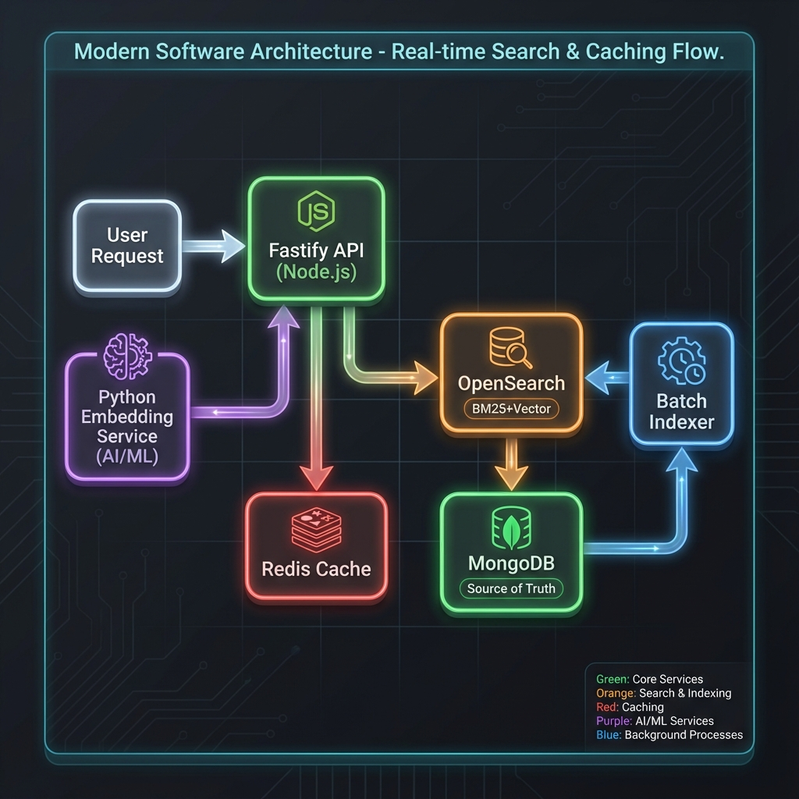

# Research Ambit Search API

Hybrid search backend for the **IIT Delhi Research Ambit** portal. Indexes ~70k Scopus papers and faculty metadata from MongoDB into OpenSearch, combines BM25 keyword retrieval with dense embeddings, and exposes a Fastify REST API used by [tech-ambit-explorer](https://github.com/IITD-Tech-Ambit/tech-ambit-explorer) and the [research chatbot](https://github.com/IITD-Tech-Ambit/chatbot-service).

**Live demo (search UI):** [iitd-tech-ambit.github.io/SEO-Backend-iitd](https://iitd-tech-ambit.github.io/SEO-Backend-iitd/)  
**API reference (Postman):** [documenter.getpostman.com/view/32690520/2sB3dWqmb1](https://documenter.getpostman.com/view/32690520/2sB3dWqmb1)

---

## What it does

| Capability | Description |
|---|---|
| **Hybrid search** | BM25 + k-NN over BGE-base embeddings, with optional cross-encoder reranking (`bge-reranker-base`) |
| **Faceted filtering** | Year, department, document type, subject area, and field filters with aggregation counts |
| **Typeahead suggest** | Blended, intent-aware autocomplete across authors and papers |
| **Author discovery** | Faculty-for-query aggregation and author-scoped semantic search |
| **Taxonomy browse** | Explore API over the 9-theme classification taxonomy (themes → domains → subdomains → faculty) |
| **Related work** | Similar-paper lookup (k-NN) and co-author collaboration graphs |
| **Incremental indexing** | Python and Go indexers sync MongoDB → OpenSearch; Redis caches queries and embeddings |

---

## Architecture

<p align="center">
  
</p>

```
Client  →  Fastify API  →  Redis (query / embedding cache)
                ├─→ Embedding service (BGE-base + reranker, Python/FastAPI)
                ├─→ OpenSearch 2.x (BM25 + HNSW k-NN)
                └─→ MongoDB (document hydration + faculty directory)
```

| Component | Stack | Role |
|---|---|---|
| Search API | Node.js 18+, Fastify | REST endpoints, validation, caching, metrics |
| Embedding service | Python 3.10+, FastAPI, Gunicorn | 768-dim BGE-base embeddings + ONNX reranker |
| Indexers | Python (`services/indexer/`) + Go (`indexer_go/`) | MongoDB → OpenSearch batch sync |
| Search engine | OpenSearch 2.x | Inverted index + vector search |
| Cache | Redis 7 | Query results, embeddings, rerank scores |
| Source DB | MongoDB 6 | Scopus metadata, faculty, taxonomy tables |

In production the service sits behind nginx as `/search/` alongside the CMS backend, frontend, embedding service, and chatbot. See [`deploy/README.md`](deploy/README.md) for the full VM layout.

---

## Related repositories

| Repository | Role |
|---|---|
| [tech-ambit-explorer](https://github.com/IITD-Tech-Ambit/tech-ambit-explorer) | React frontend (search, explore, faculty profiles) |
| [research-ambit-main](https://github.com/IITD-Tech-Ambit/research-ambit-main) | CMS / directory backend |
| [chatbot-service](https://github.com/IITD-Tech-Ambit/chatbot-service) | Agentic RAG chatbot (consumes this search API) |
| [classification-pipeline](https://github.com/IITD-Tech-Ambit/classification-pipeline) | Paper taxonomy classification architecture |

---

## Quick start (local)

### Prerequisites

- Docker & Docker Compose (OpenSearch cluster)
- Node.js 18+
- Python 3.10+ (embedding service and Python indexer)
- MongoDB with Research Ambit Scopus documents
- Redis

### 1. Clone and configure

```bash
git clone https://github.com/IITD-Tech-Ambit/SEO-Backend-iitd.git
cd SEO-Backend-iitd
cp .env.example .env
# Set OPENSEARCH_PASSWORD, MONGODB_URI, and other values
```

### 2. Start infrastructure

```bash
# OpenSearch (2-node cluster + Dashboards)
docker compose up -d

# Verify cluster health (~30 s)
curl -k -u admin:$OPENSEARCH_PASSWORD https://localhost:9200/_cluster/health
```

### 3. Start the embedding service

```bash
cd services/embedding
python -m venv venv && source venv/bin/activate
pip install -r requirements.txt
python run.py   # downloads BGE-base on first run
```

### 4. Index documents

```bash
cd services/indexer
python -m venv venv && source venv/bin/activate
pip install -r requirements.txt
python run.py --create-index --reindex-all
# incremental: python run.py --limit 1000
```

Alternatively, use the Go indexer in `indexer_go/` for high-throughput batch runs.

### 5. Start the API

```bash
npm install
npm run dev    # http://localhost:3000
```

Or run the full application stack with Docker:

```bash
docker compose -f docker-compose.services.yml up -d
```

---

## API overview

All routes are prefixed with `/api/v1`.

| Method | Path | Purpose |
|---|---|---|
| `POST` | `/search` | Hybrid BM25 + semantic search with filters and facets |
| `POST` | `/search/author-scope` | Semantic search within one author's papers |
| `GET` | `/search/faculty-for-query` | All IITD faculty matching a query |
| `GET` | `/suggest` | Blended typeahead (authors + papers) |
| `GET` | `/search/health` | OpenSearch, embedding, and Redis health |
| `GET` | `/document/:id` | Full document from MongoDB |
| `GET` | `/document/:id/similar` | k-NN similar papers |
| `GET` | `/documents/by-author/:authorId` | Paginated papers by author |
| `GET` | `/author/:id/collaborators` | Co-author network |
| `GET` | `/taxonomy/themes` | Thematic areas with counts |
| `GET` | `/taxonomy/domains` | Domains (optionally filtered by theme) |
| `GET` | `/taxonomy/domains/:slug/subdomains` | Subdomains of a domain |
| `GET` | `/taxonomy/faculty` | Faculty kerberos IDs for a browse configuration |
| `GET` | `/taxonomy/faculty/:kerberos/papers` | One faculty member's papers in a configuration |

Example:

```bash
curl -X POST http://localhost:3000/api/v1/search \
  -H "Content-Type: application/json" \
  -d '{"query": "carbon nanotubes thermal conductivity", "page": 1, "per_page": 20}'
```

Full request/response schemas: [Postman collection](https://documenter.getpostman.com/view/32690520/2sB3dWqmb1).

---

## Taxonomy ingest

The Explore section reads a precomputed taxonomy (themes, domains, subdomains) from MongoDB. To rebuild it from classification CSVs:

```bash
npm run taxonomy:ingest      # load taxonomy nodes + facet membership
npm run taxonomy:rollup      # recompute facet counts
```

---

## Testing

```bash
npm test   # unit tests (runs in CI)
```

CI (`.github/workflows/ci.yml`) runs the unit suite on GitHub-hosted runners. Integration, performance, and retrieval-evaluation suites require live OpenSearch/MongoDB/Redis on the IITD network.

---

## Project structure

```
SEO-Backend-iitd/
├── src/                    # Fastify search API
├── services/
│   ├── embedding/          # BGE embedding + reranker (Python)
│   └── indexer/            # Python batch indexer
├── indexer_go/             # Go batch indexer
├── scripts/taxonomy/       # Taxonomy ingest + rollup
├── deploy/                 # Production docker-compose + nginx (VM layout)
├── tests/                  # Unit, integration, and retrieval eval suites
└── assets/                 # README diagrams
```

---

## Production deployment

Production orchestration lives in [`deploy/`](deploy/). On the VM, copy `deploy/docker-compose.yml` and `deploy/nginx/nginx.conf` into `~/main/` alongside sibling repos (`tech-ambit-explorer`, `research-ambit-main`, `chatbot-service`). Nginx routes `/search/` to this API and `/embed/` to the embedding service.

---

## License

MIT — see [LICENSE](LICENSE).
